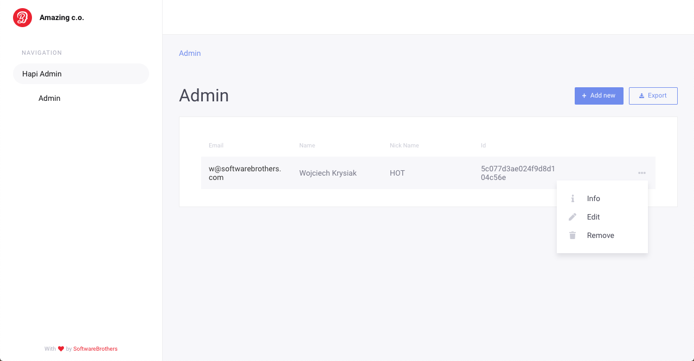

# Admin Bro

Admin Framework for nodejs apps.

Check out example app here:

login: `test@example.com`
password: `password`

https://admin-bro-example-app.herokuapp.com/admin

# How it works

AdminBro is divided into modules. On the one side we have database connectors - we call them Resources. On the other hand - rendering http frameworks.

Using this architecture allows us to add AdminBro to almost every app and present almost any type of resource.

## The diagram

<p align="center">
  
</p>

## An example admin app

Let's jump right to the example:

```javascript
// index.js
const AdminBro = require('admin-bro')

// We will use mongoose ORM - so let's require its adapter
const AdminBroMongoose = require('admin-bro-mongoose')

// We require hapijs plugin which renders adminBro using this framework
const AdminBroPlugin = require('admin-bro-hapijs')

// Other dependencies
const mongoose = require('mongoose')
const Hapi = require('hapi')

AdminBro.registerAdapter(AdminBroMongoose)

// Let's define a collection:
mongoose.model('Admin', new mongoose.Schema({
  email: String,
  name: String,
  nickName: String,
  password: String,
}))

const rootPath = '/admin'

const start = async () => {
  try {
    // we are running hapijs server as a rendering framework
    const server = Hapi.server({ port: process.env.PORT || 8080 })
    const connection = await mongoose.connect(process.env.MONGO_URL)

    // the simplest admin options - read about all options below
    const adminBroOptions = {
      databases: [connection], // we are passing mongoose database connection
      branding: {
        companyName: 'Amazing c.o.',
      },
      rootPath,
    }
    await server.register({
      plugin: AdminBroPlugin,
      options: adminBroOptions,
    })

    await server.start()
    console.log('Admin running at:', [server.info.uri, rootPath].join(''))
  } catch (error) {
    console.log(error)
    process.exit(1)
  }
}

start()
```

In order to run it you will have to install all the following dependencies:

```bash
npm install --save admin-bro admin-bro-mongoose admin-bro-hapijs mongoose hapi
```

and then:

```bash
MONGO_URL=mongodb://localhost:27017/hapi-admin node index.js
```

and this is what you get afer visiting http://localhost:8080/admin



### What's just happened?

So
* We used [hapijs](https://hapijs.com/) as a framework for rendering AdminBro routes (admin-bro-hapijs plugin)
* We wrapped [mongoose](https://mongoosejs.com/) ORM with `admin-bro-mongoose` adapter
* We defined one mongoDb collection using mongoose ORM
* We passed mongoose instance to the AdminBro via options.

And
* AdminBro took the mongoose connection
* Extracted all resources form it (`Admin` collection) using admin-bro-mongoose adapter
* Generated List, Show, Edit and New views along with 3 actions: update, create and delete for those resources.
* and finally the AdminBro uses hapijs to render routes under `'/admin'` path

## What next

So since now you know the basics, it is time for more advanced topics:

* [List of all AdminBro options](https://softwarebrothers.github.io/admin-bro/global.html#AdminBroOptions)
* [Resource customization](https://softwarebrothers.github.io/admin-bro/tutorial-resource-decorators.html)

## License

AdminBro is Copyright © 2018 SoftwareBrothers.co. It is free software, and may be redistributed under the terms specified in the [LICENSE](LICENSE) file.

## About SoftwareBrothers.co


We’re an open, friendly team that helps clients from all over the world to transform their businesses and create astonishing products.

* We are available to [hire](https://softwarebrothers.co/contact).
* If you want to work for us - checkout the [career page](https://softwarebrothers.co/career).