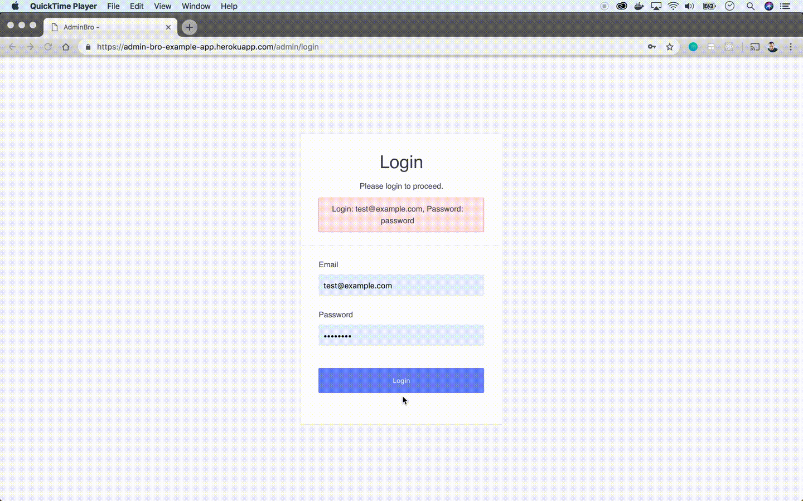

# AdminJS

[AdminJS](https://softwarebrothers.github.io/adminjs-dev/) is An automatic admin interface which can be plugged into your application. You, as a developer, provide database models (like posts, comments, stores, products or whatever else your application uses), and AdminJS generates UI which allows you (or other trusted users) to manage content.

Inspired by: [django admin](https://docs.djangoproject.com), [rails admin](https://github.com/sferik/rails_admin) and [active admin](https://activeadmin.info/).

## How it looks

## Example application

Check out the example application with mongodb and postgres models here:

- login: `test@example.com`
- password: `password`

https://admin-bro-example-app-staging.herokuapp.com/admin/login

## Getting started

- Check out the [documentation](https://adminjs.co)
- Try the [live demo](https://admin-bro-example-app-staging.herokuapp.com/admin/login) as mentioned above

## OpenSource SoftwareBrothers community

- [Join the community](https://join.slack.com/t/AdminBro/shared_invite/zt-djsqxxpz-_YCS8UMtQ9Ade6DPuLR7Zw) to get help and be inspired.
- subscribe to our [newsletter](http://opensource.softwarebrothers.co)

# What kind of problems it solves

So you have a working service built in Node.js. It uses (for example) [Hapi.js](https://hapijs.com/) for rendering a couple of REST routes and [mongoose](https://mongoosejs.com/) as the _connector_ to the database.

Everything works fine, but now you would like to:
* see all the data in the app,
* perform custom _business_ actions on objects in the database,
* bootstrap the tables with the _initial_ data,
* build custom report pages,
* allow other team members (not necessary programmers) to see what is going on in the application.

And all these cases can be solved by AdminJS. By adding couple of lines of code you have a running admin interface.

# Features

* CRUD any data in any resource
* Custom actions
* Form validation based on schema in your resources
* Full featured dashboard with widgets
* Custom resource decorators

## Contribute

If you would like work on an adminjs and develop new features - take a look at our dev repository: https://github.com/SoftwareBrothers/adminjs-dev

You can find there instructions on how to run adminjs for development.

## License

AdminJS is Copyright © 2021 SoftwareBrothers.co. It is free software, and may be redistributed under the terms specified in the [LICENSE](LICENSE.md) file.

## About SoftwareBrothers.co

We’re an open, friendly team that helps clients from all over the world to transform their businesses and create astonishing products.

* We are available for [hire](https://softwarebrothers.co/contact).
* If you want to work for us - check out the [career page](https://softwarebrothers.co/career).
